本篇记录了学习C++多线程编程的笔记。

<!-- more -->

使用多线程编程的目的在于：充分利用系统已有的硬件，在同样的时间内完成更多的事情。多线程编程本身就是一个庞大的主题，而C++的历史包袱和能够直接使用系统库的特点又使得这个问题更加的复杂。不过，从C++11开始，只使用C++语言层次提供的接口，也能够较好的完成多线程编程任务了。

> 希望本篇足够的全面；但是短时间内肯定是做不到的，后续有了新的想法再继续更新吧。

## 回调函数

### 理解回调函数

回调函数在异步操作中十分常见。通常情况下，C++进程会创建线程池进行多个异步操作。回调函数的作用就在于将原本同步的业务逻辑包装成为一个函数指针，后续只需要指定一个线程池中的空闲线程处理即可完成异步操作。

在理解回调函数时，应当考虑到进程使用事件循环的模型：事件循环可以简单的理解为一个死循环，当事件队列中存在未处理的事件时，循环将会根据类型，指定一个线程池中的线程去处理。不难发现，其实这里的事件就是一个回调函数。下面以一个读文件的操作为例，展示同步和异步两种方式读取文件的过程。

```cpp
#include <unistd.h>
#include <cstdio>
#include <cstdlib>
#include <functional>
#include <iostream>
#include <memory>
#include <string>
#include <thread>

#define USE_SYNC 0

int ReadFile(const std::string& filename, std::string& content) {
  auto Deleter = [](FILE* fp) { fclose(fp); };
  std::unique_ptr<FILE, decltype(Deleter)> fp(fopen(filename.c_str(), "r"),
                                              Deleter);
  if (!fp.get()) {
    return 1;
  }

  fseek(fp.get(), 0, SEEK_END);
  long fsize = ftell(fp.get());
  rewind(fp.get());

  auto buffer = std::make_unique<char[]>(fsize);
  int rsize = fread(buffer.get(), 1, fsize, fp.get());
  if (rsize != fsize) {
    return 1;
  }

  content = std::string(reinterpret_cast<const char*>(buffer.get()), fsize);
  return 0;
}

void AsyncReadFile(const std::string& filename,
                   std::function<void(int, std::string&)> callback) {
  std::string content;
  int code = ReadFile(filename, content);
  callback(code, content);
}

int main(int argc, char* argv[]) {
  std::string home = std::getenv("HOME");
  const std::string filename = home + "/.zshrc";
  std::string content;

#if USE_SYNC
  if (0 != ReadFile(filename, content)) {
    std::cerr << "ERROR: cannot read file synchronously." << std::endl;
  }
#else
  auto callback = [&content](int code, std::string& fcontent) {
    if (code == 0) {
      content.swap(fcontent);
    } else {
      std::cerr << "ERROR: cannot read file asynchronously." << std::endl;
    }
  };

  std::thread t(AsyncReadFile, filename, callback);
  if (t.joinable()) {
    t.join();
  }
#endif  // USE_SYNC

  std::cout << "content -> [" << content << "]" << std::endl;

  return 0;
}
```

> 这里其实没有考虑诸如：`content`变量的生命周期，`content`是否存在多余的拷贝行为，读文件耗时操作是否会出现时序不一致等问题。实际的开发过程往往要比这个复杂的多。

### std::function

`std::function`可以简单理解为一个函数指针的包装，使得函数能够像参数一样被传递。`std::function`对象可以指向仿函数、lambda函数、其他函数对象等；`std::function`是一个模板类，其类型会根据模板参数的不同而不同：`std::function<void()>`和 `std::function<void(int)>`就两种不同的 `std::function`。

此外，如果 `std::function`的类型与需要包装的函数参数并不相同，可以通过 `std::bind`进行绑定。

```cpp
#include <iostream>
#include <functional>

int main(int argc, char* argv[]) {
  auto lambda = [](int v1, int v2) { return v1 + v2; };
  // |func(v)| equals to |lambda(1, v)|
  std::function<int(int)> func = std::bind(lambda, 1, std::placeholders::_1);
  std::cout << func(1) << std::endl;

  return 0;
}
```

> 后文中，名词*线程执行体*在默认情况下就表示一个 `std::function`对象，或者是一个lambda函数。

## 多线程编程接口

C++11中提供了多个用于多线程编程的接口，开发者可以更加方便的操作线程。按照从低到高的抽象层次，这些接口可以分类为下面的等级。通过不同程度的包装，接口逐渐变得抽象，开发者也可以将自己的注意力转移到任务本身，而不是如何操作线程上。

+ `std::thread`。
+ `std::thread`，`std::future`，`std::promise`。
+ `std::thread`，`std::future`，`std::packaged_task`。
+ `std::future`，`std::async`。

<figure markdown>
  { loading=lazy }
</figure>

### std::thread

`std::thread`是C++多线程编程中最为基础的类，他是对系统平台线程库的封装。`std::thread`接口有如下的一些特点。

1. `std::thread`构造时传递空参数会得到一个空的对象，该对象不表示任何线程实体。
2. `std::thread`没有 `start`方法，非空对象构造成功后，对象表示的线程实体就已经启动运行了。
3. `std::thread`没有拷贝构造函数和拷贝运算符，无法让两个对象指向同一个线程实体。
4. `std::thread`对象对线程实体的持有可以使用 `std::move`转移，转移后原对象就不再表示任何线程实体。
5. `std::thread`对象构造后，可以 `join`或 `detach`。`join`方法会等待线程执行完成后再继续；`detach`方法则不会等待。

```cpp
std::thread t1;  // 空线程对象
std::thread t2([](const std::string& s) {
  std::cout << s << std::endl;
  // wait for 2s.
}, "Hello World!");  // 使用lambda函数作为运行实体 并传递了一个string类型的参数
t1 = std::move(t2);  // 线程所有权转移至t1 t2不再表示任何线程实体
if (t1.joinable()) {  // 如果t1还在运行 可join 那就等待t1执行完成
  t1.join();
}
```

### std::thread/std::future/std::promise

直接使用 `std::thread`完成多线程编程是完全可行的，线程执行体可以十分方便的在创建线程时传递参数。然而，考虑到返回值时，`std::thread`的操作就十分别扭。通常的做法是：在线程启动前约定好一个内存空间用于存储结果，然后将指向该内存空间的指针作为参数传递到 `std::thread`对象中，线程执行完毕后写入结果，最后其他线程使用指针读取结果。多个线程同时读取一个内存区域需要数据保护和同步来保证结果符合预期，在程序区域复杂后，维护难度指数增加。

为了更加方便在线程之间传递需要的结果，C++11提供了 `std::future`和 `std::promise`接口来完成多个线程的数据传递问题。需要注意的是：这两个接口仅提供了线程传递数据的方式，线程的创建依旧需要 `std::thread`完成。

```cpp
#include <future>
#include <iostream>
#include <numeric>
#include <thread>
#include <vector>

int main(int argc, char* argv[]) {
  auto accumulate = [](auto begin, auto end, std::promise<int> promise) {
    int sum = std::accumulate(begin, end, 0);
    promise.set_value(sum);
  };

  std::promise<int> promise;
  std::future<int> fut = promise.get_future();

  std::vector<int> v{1, 2, 3, 4, 5, 6};
  std::thread t(accumulate, v.begin(), v.end(), std::move(promise));
  std::cout << fut.get() << std::endl;
  t.join();

  return 0;
}
```

虽然使用 `std::future`和 `std::promise`可以在线程间更方便传递数据，但也有一些限制。

1. `std::future`使用 `get`方法取回数据；默认情况下，若 `std::promise`未写入结果，线程将会阻塞等待。
2. `std::future`可以使用 `wait`，`wait_for`，和 `wait_until`进行不同方式的阻塞等待。
3. `std::future`和 `std::promise`之间的数据通道只能使用一次，多次使用会抛出异常。
4. `std::future`在语义上是独享的，没有拷贝操作，但是可以转移；如果想使用共享语义，可以使用 `std::shared_future`。

```cpp
#include <future>
#include <iostream>
#include <numeric>
#include <thread>
#include <vector>

int main(int argc, char* argv[]) {
  auto accumulate = [](auto begin, auto end, std::promise<int> promise) {
    int sum = std::accumulate(begin, end, 0);
    promise.set_value(sum);
  };

  std::promise<int> promise;
  std::shared_future<int> fut = promise.get_future();

  auto print = [&fut]() {
    fut.wait();  // block and wait
    std::cout << "tid = [" << std::this_thread::get_id() << "] -> acc = ["
              << fut.get() << "]" << std::endl;
  };

  std::vector<int> v{1, 2, 3, 4, 5, 6};
  std::thread t1(accumulate, v.begin(), v.end(), std::move(promise));
  // Both thread want the asynchronous result.
  std::thread t2(print);
  std::thread t3(print);

  if (t1.joinable())
    t1.join();
  if (t2.joinable())
    t2.join();
  if (t3.joinable())
    t3.join();

  return 0;
}
```

### std::thread/std::future/std::packaged_task

`std::packaged_task`更进一步，将 `std::promise`和线程执行体封装在一起，进一步提升了多线程的编程体验。

```cpp
#include <future>
#include <iostream>
#include <numeric>
#include <thread>
#include <vector>

int main(int argc, char* argv[]) {
  auto accumulate = [](auto begin, auto end) {
    return std::accumulate(begin, end, 0);
  };

  std::packaged_task<int(std::vector<int>::iterator begin,
                         std::vector<int>::iterator end)>
      task(accumulate);
  std::future<int> fut = task.get_future();

  std::vector<int> v{1, 2, 3, 4, 5, 6};
  std::thread t(std::move(task), v.begin(), v.end());
  std::cout << fut.get() << std::endl;
  t.join();

  return 0;
}
```

### std::future/std::async

上面所述的几种多线程编程方式都需要 `std::thread`显式创建线程，线程运行结束后，还需要显式的合并或分离，显得十分繁琐。`std::future`和 `std::async`的组合就将对线程的操作封装起来，免去了显式操作线程的麻烦。

```cpp
#include <future>
#include <iostream>
#include <numeric>
#include <vector>

int main(int argc, char* argv[]) {
  auto accumulate = [](auto begin, auto end) {
    return std::accumulate(begin, end, 0);
  };

  std::vector<int> v{1, 2, 3, 4, 5, 6};
  std::future<int> fut =
      std::async(std::launch::async, accumulate, v.begin(), v.end());
  std::cout << fut.get() << std::endl;

  return 0;
}
```

与直接使用 `std::thread`不同，`std::async`存在执行策略的概念，分别是：`std::launch::async`和 `std::launch::deferred`。

1. `std::launch::async`：立即发射异步操作。
2. `std::launch::deferred`：异步操作延迟到 `std::future`的 `get`或 `wait`方法被调用时发射；如果没有调用 `get`或 `wait`方法，则异步操作永远不会被发射。
3. 在不指定执行策略时，`std::async`将使用 `std::launch::async | std::launch::deferred`执行策略；在该策略下，`std::async`会负载均衡等操作，可能立刻发射异步操作，也可能延迟发射；即，发射的时机交由系统决定。

### std::future_status

`std::future`和 `std::shared_future`使用 `wait_for`和 `wait_until`方法时，会返回 `std::future_status`，用于表示 `std::future`和 `std::shared_future`的状态。这里，`std::future_status`共有三种状态。

1. `std::future_status::timeout`：等待超时。
2. `std::future_status::ready`：数据已写入，可以使用 `get`方法读取。
3. `std::future_status::deferred`：数据通道中包含延迟启动行为，在显式请求时才会发射异步操作。

> 关于 `deferred`的理解，可以看cppreference的解释：lazy evaluation is performed: the first call to **a non-timed wait function on the std::future** that async returned to the caller will cause the copy of f to be invoked (as an rvalue) with the copies of args... (also passed as rvalues) in the current thread (which does not have to be the thread that originally called std::async)。

```cpp
#include <chrono>
#include <future>
#include <iostream>
#include <thread>

using namespace std::chrono_literals;

int main() {
  std::future<int> future = std::async([]() {
    std::this_thread::sleep_for(3s);
    return 8;
  });

  std::cout << "waiting...\n";
  std::future_status status;
  do {
    status = future.wait_for(1s);
    switch (status) {
      case std::future_status::deferred:
        // If |std::async|'s launch policy is |deferred|, we will get stucked in
        // an infinite loop here. So call |wait| or |get| here to avoid this
        // situation.
        // future.wait();  // <- Uncomment it to get rid of infinite loop.
        std::cout << "deferred\n";
        break;
      case std::future_status::timeout:
        std::cout << "timeout\n";
        break;
      case std::future_status::ready:
        std::cout << "ready!\n";
        break;
    }
  } while (status != std::future_status::ready);

  std::cout << "result is " << future.get() << std::endl;

  return 0;
}
```

## 数据保护与和线程同步

### 互斥锁

临界区是指可以被多个线程共同访问的逻辑片段。由于多个线程均可访问，在不加任何限制的情况下，对临界区中的变量修改可能并不符合预期。互斥锁就是一种临界区的访问限制，他能够保证同一时刻进入到临界区的线程最多只有一个。这样，与临界区相关的操作就与单线程无异，最终的结果也会正确。

当互斥锁被持有时，其他想要进入到临界区的线程就必须等待锁的持有线程释放才能再次竞争锁的所有权。下面给出一个简单的小例子，在不使用互斥锁时，最终的计算结果在多数情况下是不正确的，且每次计算的结果都不太一样。

```cpp
#include <iostream>
#include <mutex>
#include <thread>

int main(int argc, char* argv[]) {
  std::mutex mtx;
  int count = 0;
  auto foo = [&mtx, &count]() {
    for (int i = 0; i < 50000; i++) {
      mtx.lock();
      count++;
      mtx.unlock();
    }
  };

  std::thread t1(foo);
  std::thread t2(foo);
  if (t1.joinable())
    t1.join();
  if (t2.joinable())
    t2.join();

  std::cout << count << std::endl;  // count=100000

  return 0;
}
```

`std::mutex`是C++提供的最基础的互斥锁类型。除此之外，C++提供了三种用途不同的互斥锁：`std::recursive_mutex`，`std::timed_mutex`，和 `std::recursive_timed_mutex`。

1. `std::recursive_mutex`：支持递归加锁，但是需要保证加锁的深度和解锁的深度一致，否则会出现死锁现象。
2. `std::timed_mutex`：线程在等待时将会判断其是否超时，未超时则线程会阻塞等待获取锁，超时则不再阻塞等待而是继续执行。
3. `std::recursive_timed_mutex`：支持递归加速的 `std::timed_mutex`。

### 死锁和RAII

死锁现象是指多个线程因为资源竞争而互相等待的现象。下面就是一个死锁例子。

```cpp
#include <functional>
#include <iostream>
#include <mutex>
#include <thread>

int main(int argc, char* argv[]) {
  std::mutex mtx;
  int count = 4;

  auto foo = [&mtx, &count]() {
    std::function<void(int)> f;
    f = [&mtx, &f](int count) {
      if (count == 0) {
        return;
      }
      mtx.lock();
      count--;
      // Recursive call, thread is blocked by himself.
      // It's quite easy to fix it.
      f(count);
      mtx.unlock();
    };
    f(count);
  };

  std::thread(foo).join();

  return 0;
}
```

随着代码逻辑趋于复杂，函数的出口逐渐变多，十分容易漏写 `unlock`，进而导致死锁问题。针对这一问题，C++提供了一些RAII类，利用对象的生命周期来管理互斥锁，避免出现锁忘记释放的情况。

`std::lock_guard`相对简单，且开销较小；`std::unique_lock`内部可以维护锁的状态，使用更加灵活，也带来了额外的开销，常常与 `std::condition_variable`配合使用。

```cpp
#include <iostream>
#include <memory>
#include <mutex>
#include <thread>

int main(int argc, char* argv[]) {
  int count = 0;
  std::mutex mtx;
  auto foo = [&mtx, &count]() {
    for (int i = 0; i < 50000; i++) {
      // std::lock_guard<std::mutex> lock(mtx);
      std::unique_lock<std::mutex> lock{mtx, std::defer_lock};
      lock.lock();
      count++;
    }
  };

  std::thread t1(foo);
  std::thread t2(foo);
  if (t1.joinable())
    t1.join();
  if (t2.joinable())
    t2.join();

  std::cout << count << std::endl;  // count=100000

  return 0;
}
```

### 条件变量

条件变量是一种底层的同步原语，可以用于多个线程之间的同步操作。条件变量的基原理是：若条件不满足，则让出处理器，进入阻塞状态；如条件满足，则会被唤醒继续处理。条件变量往往需要和互斥锁一同使用达到阻塞等待的效果。

```cpp
#include <condition_variable>
#include <functional>
#include <iostream>
#include <mutex>
#include <thread>

int main(int argc, char* argv[]) {
  std::mutex mtx;
  std::condition_variable cv;

  bool ready = false;
  bool weakened = false;

  auto foo = [&]() {
    std::unique_lock<std::mutex> lock(mtx);
    cv.wait(lock, [&ready]() { return ready; });
    std::cout << "foo cv is ready." << std::endl;
    weakened = true;
    lock.unlock();
    cv.notify_one();
  };

  std::thread t(foo);
  {
    std::lock_guard<std::mutex> lock(mtx);
    ready = true;
  }
  cv.notify_one();

  {
    std::unique_lock<std::mutex> lock(mtx);
    cv.wait(lock, [&weakened]() { return weakened; });
    std::cout << "foo cv is weakened." << std::endl;
  }

  if (t.joinable())
    t.join();

  return 0;
}
```

在使用条件变量时，`wait`接受的第一个参数是 `std::unique_lock`，第二个参数是一个可调用对象，且返回一个 `bool`值（相当于 `while(!__p()) ...`）。

### thread_local

在C++中，`thread_local`关键字用于声明线程独有的变量。`thread_local`变量的生命周期与线程的生命周期一致。所以，可以认为 `thread_local`变量是作用范围在线程内部的 `static`变量。

```cpp
#include <iostream>
#include <thread>

thread_local int v = 0;

int main(int argc, char* argv[]) {
  auto func = [](const std::string& tname) {
    std::cout << "thread_name = [" << tname << "]; v = [" << (long)(&v)
              << "]" << std::endl;
  };

  std::thread t1(func, "t1");
  std::thread t2(func, "t2");
  if (t1.joinable())
    t1.join();
  if (t2.joinable())
    t2.join();

  return 0;
}
```

## 第三方库

在实际的开发工作中，直接使用C++的多线程编程接口的场景是极少的，更多的时候，我们直接选择使用项目中已经集成的线程库。下简单介绍几个我目前知道的多线程库。

### Chromium Base

base库是chromium中一个相对独立的模块，提供了许多工具类，其中就包括了多线程库。

```cpp
#include "base/at_exit.h"
#include "base/command_line.h"
#include "base/logging.h"
#include "base/run_loop.h"
#include "base/task/single_thread_task_executor.h"
#include "base/task/thread_pool.h"
#include "base/task/thread_pool/thread_pool_instance.h"
#include "base/time/time.h"

int main(int argc, char* argv[]) {
  base::AtExitManager at_exit;
  base::CommandLine::Init(argc, argv);
  logging::SetLogItems(true, true, true, false);

  base::SingleThreadTaskExecutor main_thread_task_executor;
  base::ThreadPoolInstance::CreateAndStartWithDefaultParams("demo");

  // Logging in 4 seconds.
  base::ThreadPool::PostDelayedTask(
      FROM_HERE, base::BindOnce([]() { LOG(INFO) << "Task Logging."; }),
      base::Seconds(4));
  LOG(INFO) << "Hello, World.";
  base::RunLoop().Run();

  return 0;
}
```

### Qt Concurrent

QtConcurrent是Qt提供的并发接口。除了 `run`方法，还提供了 `map`，`filter`等比较高级的并发语义。

```cpp
#include <algorithm>
#include <iostream>
#include <numeric>

#include <QFuture>
#include <QThreadPool>
#include <QVector>
#include <QtConcurrent>
#include <QtGlobal>

int main(int argc, char* argv[]) {
  QVector<qint32> v = {1, 2, 3, 4, 5, 6};
  QFuture<qint32> sum = QtConcurrent::run(
      QThreadPool::globalInstance(),
      [](auto& begin, auto& end) { return std::accumulate(begin, end, 0); },
      v.begin(), v.end());

  qDebug() << sum;

  return 0;
}
```

### taskflow

taskflow也是一个比较出名的多线程库，且支持多种硬件设备的加速。与普通的线程库不同，taskflow支持为任务之间添加依赖关系。在建立了任务之间的依赖关系后，事件之间的同步行为就将被确定，taskflow将据此最大化利用硬件。

```cpp
#include <iostream>
#include <taskflow/core/executor.hpp>
#include <taskflow/core/taskflow.hpp>
#include <taskflow/taskflow.hpp>

int main(int argc, char* argv[]) {
  tf::Executor executor;
  tf::Taskflow taskflow;
  auto [A, B, C, D] = taskflow.emplace(
    []() { std::cout << "task A" << std::endl; },
    []() { std::cout << "task B" << std::endl; },
    []() { std::cout << "task C" << std::endl; },
    []() { std::cout << "task D" << std::endl; }
  );

  A.precede(B, C);
  D.succeed(B, C);
  B.precede(C);

  executor.run(taskflow).wait();

  return 0;
}
```

## 小小的总结

多线程编程中可说的内容很多，本篇也只是描述了一些其中的皮毛。在使用了封装好的线程库之后，开发者将能够把更多的注意力集中于业务逻辑中，但也会遇到生命周期，时序等问题。总的来说，多线程带来的异步行为提高了硬件的利用率。此外，随着C++标准的不断更新，诸如协程、executor、信号量等工具被加入到标准库中，可以使用的工具变多了，脑阔也会更疼了。

## 参考链接

+ [What is the purpose of std::function and how to use it?](https://stackoverflow.com/questions/20353210/what-is-the-purpose-of-stdfunction-and-how-to-use-it)
+ [std::function](https://www.cnblogs.com/heartchord/p/5017071.html)
+ [C++11新特性之std::function](https://blog.csdn.net/wangshubo1989/article/details/49134235)
+ [Concurrency support library](https://en.cppreference.com/w/cpp/thread)
+ [C++ 執行緒：promise、future、packaged_task 與 async 的使用方法](https://zh-blog.logan.tw/2021/09/26/cxx-thread-promise-future-packaged-task-async-usage/)
+ [C++11 多线程 future/promise简介](https://blog.csdn.net/jiange_zh/article/details/51602938)
+ [通俗讲解c++ future/shared_future](https://blog.csdn.net/qq_38836770/article/details/108827652)
+ [c++ 如果异步执行是必需的，指定std::launch::async策略](https://zhuanlan.zhihu.com/p/349349488)
+ [c++多线程（十九） - std::timed_mutex](https://blog.csdn.net/liyazhen2011/article/details/89811564)
+ [C++11 std::unique_lock与std::lock_guard区别及多线程应用实例](https://www.cnblogs.com/fnlingnzb-learner/p/9542183.html)
+ [C++11多线程编程(三)——lock_guard和unique_lock](https://zhuanlan.zhihu.com/p/340348726)
+ [std::unique_lock与std::lock_guard](https://www.jianshu.com/p/7eba4f722e07)
+ [std::unique_lock](https://stackoverflow.com/questions/20516773/stdunique-lockstdmutex-or-stdlock-guardstdmutex)
+ [std::lock_guard和std::unique_lock的差别](https://chhy2009.github.io/2018/09/23/c11concurrency/c11concurrency/)
+ [C++ 11 关键字：thread_local](https://zhuanlan.zhihu.com/p/77585472)
+ [Storage class specifiers](https://en.cppreference.com/w/cpp/language/storage_duration)
+ [All about thread-local storage](https://maskray.me/blog/2021-02-14-all-about-thread-local-storage)
+ [chromium/src/base - Git at Google](https://chromium.googlesource.com/chromium/src/base/)
+ [QtConcurrent::run()](https://doc.qt.io/qt-6.2/concurrent-changes-qt6.html#qtconcurrent-run)
+ [taskflow/taskflow - A General-purpose Parallel and Heterogeneous Task Programming System](https://github.com/taskflow/taskflow.git)

## 更新和TODO

+ [X] 多线程基本操作：`std::thread`……
+ [ ] 原子量和内存序
+ [ ] 协程，用户态线程
+ [ ] 编译器和TLS存储区
+ [ ] asio和libunifex
